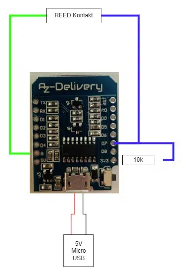

# Gaszähler
Digitaler Gaszähler für alle Gaszähler mit Inkrementalgeber hinter der letzten Uhrenziffer (das haben sehr viele).  
Beim Übertrag der letzten Ziffer von 9 auf 0 wird der Inkrementalgeber ausgelöst und das Magnetfeld mittels eines Reed-Sensors gemessen.  
Die Daten werden vom ESP8266 über seine IP-Adresse als Webseite dargestellt. Über das Webinterface lässt sich auch der Anfangszählerstand bearbeiten.  
Desweiteren werden die Daten an Thingspeak.com-Server übertragen und dort automatisch alle 60 Sekunden in einem Diagramm veröffentlich.  
Diese Daten lassen sich wiederum über die Read-API z.B. per Smartphone auslesen und anzeigen etc.

## Benötigte Bauteile:  
- Wemos D1 Mini oder anderen Esp8266
- Reed-Sensor beliegen Fabrikats , die aus Glas brechen sehr schnell
- 10kOhm oder ähnlich hoher Widerstand  

Verkabelung wie folgt:  

## Anpassungen am Code:  

Datei src/Connect.ino:  
- Zeile 30: const char* ssid ="Wifiname";  
- Zeile 31: const char* password = "Wifipasswort";  

Falls anderer Digitaler Pin als D7 verwendet wird:  
Datei src/Gaszaehler.ino:  
- Zeile 32: const byte inputPIN = D7;  

Anpassen des Write-API-Keys zum Schreiben auf Thingspeak.com. Der Key ist in den Channeleinstellungen  zu finden.  
Field1 sollte am besten die Bezeichnung "Gas [m³]" erhalten.  
Datei src/Thingspeak.ino  
- Zeile 28: const char* APIKEY = {"WRITEAPIKEY"};  

Der Code stammt überwiegend von: https://fipsok.de  
